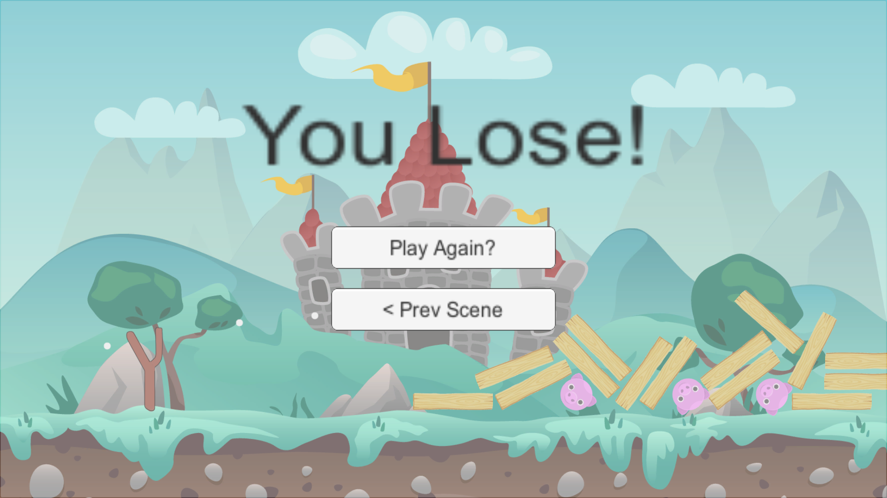

# Unity Angry Birds Game

## Features

1. Exploding Owl and Enemy
2. 2 Level
3. UI (Win and Lose Condition and Play Again)
4. Sound effect

## Documentation

### Game Preview
     

### Demo

## Prerequisite

- [Unity 2018.3.3 ](https://unity3d.com/get-unity/download/archive)

## Installation

- Add [Unity](https://store.unity.com/front-page?check_logged_in=1#plans-individual) to your machine

- Add this project folder on Unity and run

## License

Created by Jorge.P.

## Link

https://github.com/JorgePerezGarcia/Angry-Birds